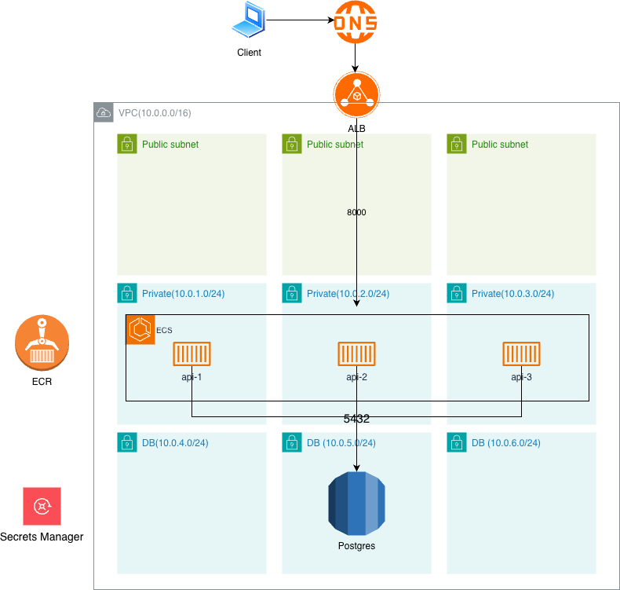

# PART 1

## 아키텍처 개요

### 클라우드 아키텍처 다이어그램



### 아키텍처 설명

- **VPC (10.0.0.0/18)**: 3개의 가용 영역(AZ)에 걸쳐 구성
  - **Public Subnets**: ALB 및 NAT Gateway
  - **Private Subnets (10.0.1.0/24, 10.0.2.0/24, 10.0.3.0/24)**: ECS 서비스
  - **DB Subnets (10.0.4.0/24, 10.0.5.0/24, 10.0.6.0/24)**: RDS PostgreSQL

- **인프라(기술 스택)**
  - **컨테이너 오케스트레이션**: AWS ECS on Fargate
  - **로드 밸런서**: AWS Application Load Balancer
  - **데이터베이스**: AWS RDS PostgreSQL
  - **데이터베이스 비밀번호 관리**: AWS Secrets Manager
  - **컨테이너 레지스트리**: AWS ECR
  - **IaC**: Terraform
  - **CI/CD**: GitHub Actions

- **트래픽 흐름**:
  1. 클라이언트 → DNS → ALB (포트 80), 포트 443은 ACM 및 도메인 추가 리소스 발생으로 주석 처리
  2. DNS(구현 X) → ALB → ECS 서비스 (포트 8000)
  3. 각 컨테이너 내 FastAPI → RDS PostgreSQL (포트 5432)

---

## IaC 구조

```
infra/
├── main.tf              # 메인 소스
├── data.tf              # 필수 구성 변수
├── provider.tf          # 테라폼(v1.14.0) 및 AWS Provider(v6.25.0) 선언
└── modules/
    ├── vpc/             # VPC, Subnet, NAT Gateway
    ├── alb/             # Application Load Balancer
    ├── ecs/             # ECS Cluster, Service, Task Definition, Secrets Manager
    ├── rds/             # RDS PostgreSQL
    ├── ecr/             # ECR Repository
    └── iam/             # ECS Task, Execution Role
```

---

## 기술 선택 및 설계 근거

### 1. 가용성
- **ECS on Fargate**:
  - Fargate 기반 컨테이너이기 때문에 ECS 외 인프라 관리 부담 없음
  - Service AutoScaling을 통해 Crontab(매월말 3일 전, 매월 1일), Metric(CPU 사용률) 기반의 오토스케일링 설계
  - 기본적으로 Rolling Update 방식이기 때문에 빠른 배포에 적합

### 2. 보안 및 데이터 관리
  - 데이터베이스: 프라이빗 서브넷 그룹 할당
  - 민감 정보 관리: 데이터베이스 암호는 Secrets Manager 저장, CI/CD 파이프라인의 경우 OIDC를 통해 AWS 리소스에 접근

---

## CI/CD 파이프라인

### GitHub Actions 워크플로우

#### 1. CI (Pull Request)
`.github/workflows/ci.yml`:
  - **Lint**: `ruff check` - 코드 품질 검사
  - **Format**: `ruff format --check` - 코드 포맷팅 검사
  - **Test**: Runner 내부에서 데이터베이스 및 애플리케이션 실행하여 헬스체크 수행

#### 2. Build (Push to main)
`.github/workflows/build.yml`:
  - **Docker 이미지 빌드**: ECR에 푸시
  - **태그**: Git short hash 기반 태깅
  - **Repository Dispatch**: Deploy 워크플로우 트리거

#### 3. Deploy (Repository Dispatch)
`.github/workflows/deploy.yml`:
  - **ECS Task Definition 업데이트**: 새 이미지 태그 변경
  - **ECS Service 업데이트**: 무중단 배포 실행

---

## 운영 자동화 및 장애 대응 계획

### 모니터링 전략
- ECS 평균 CPU Utilization >= 60% → 서비스 오토스케일링 트리거
- CloudWatch: DatabaseConnections/max_connections >= 80% → 알람
- Database SlowQuery >= 3000ms → 슬랙 봇 연동하여 쿼리 출력
- 서비스 5xx 또는 4xx 응답 / 전체 요청 >= 5% → 긴급 알람

### 무중단 배포 전략

- **ECS Rolling Update 배포**
  1. 새 태스크 정의 생성 (새 이미지 태그)
  2. 새 태스크를 점진적으로 시작 (헬스체크 통과 대기)
  3. ALB가 새 태스크로 트래픽 라우팅
  4. 기존 태스크를 점진적으로 종료
  5. 배포 완료

- **롤백**
  - 이전 태스크 정의로 즉시 롤백 가능
  - ECS Service 업데이트로 이전 버전으로 복구

---

## 장애 대응 시나리오

### DB Connection Pool 고갈 상황

**대응 절차**:
1. **즉시 대응**:
  - DatabaseConnections 및 ALB 5xx 응답 확인
  - Idle 세션 종료

2. **근본 원인 분석**:
  - 애플리케이션 코드 내 Session close 생략 유무 확인
  - 데이터베이스 슬로우 쿼리 및 스펙 확인

3. **재발 방지**:
  - RDS Proxy 도입
  - 슬로우 쿼리 모니터링 도입
    [query-bot](query_bot.png)
  - DB 인스턴스 스펙 업그레이드

---

## 비용 최적화 시나리오

### 월 비용 30% 초과

- **도구 활용**
  1. **AWS Cost Explorer**
    - 비용 그래프에서 특정 날짜 또는 특정 서비스 급증 확인
    - RI 또는 SP 적용률이 떨어졌는지 확인

  2. **AWS Compute Optimizer**
    - EC2 인스턴스 유형 과다 프로비저닝 체크
    - EBS gp2 타입 체크
    - Lambda 메모리 체크
    - ECS on Fargate CPU, 메모리 과다 프로비저닝 체크

  3. **CloudWatch**
    - 유휴 리소스 요청/응답 확인

- **개선안**
  1. AWS Config 활용하여 일부 리소스 생성 감지 알람 구성 
    [detection-bot](detection_bot.png)
  2. VPC 내부 리소스 간 통신은 PrivateLink 구축하여 퍼블릭 요금 발생 방지
  3. Compute Optimizer에서 요구하는 사양으로 다운그레이드 진행
  4. EKS가 있는 경우 항상 최신 버전 업그레이드(표준 지원이 아닌 경우 월 $360 추가 지불)
  5. S3의 경우 한 달이상 지난 객체는 Standard-IA 전환(비용 절반 감소 효과)